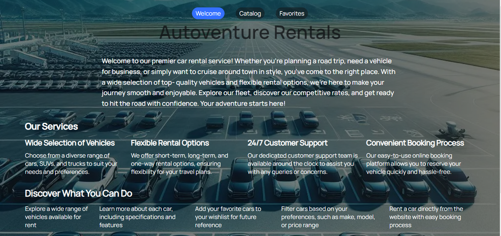
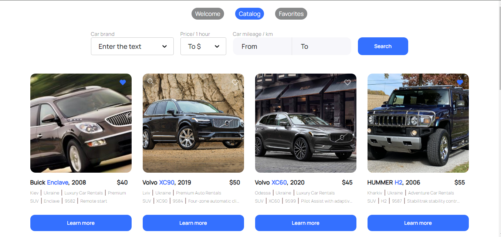
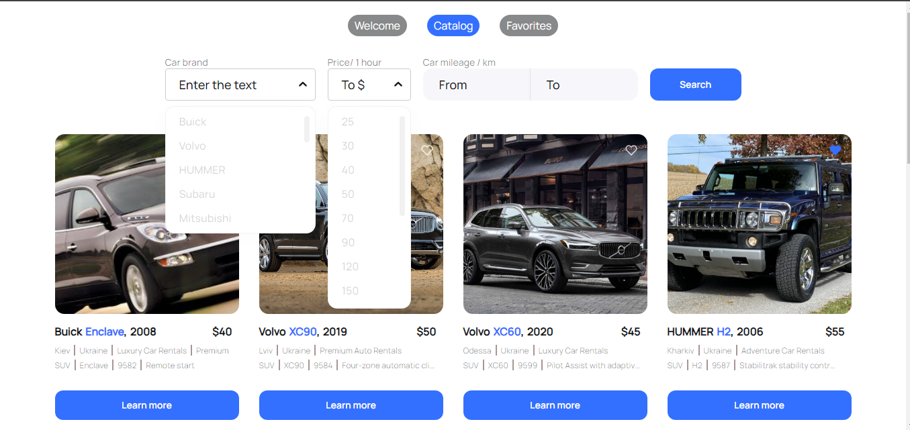
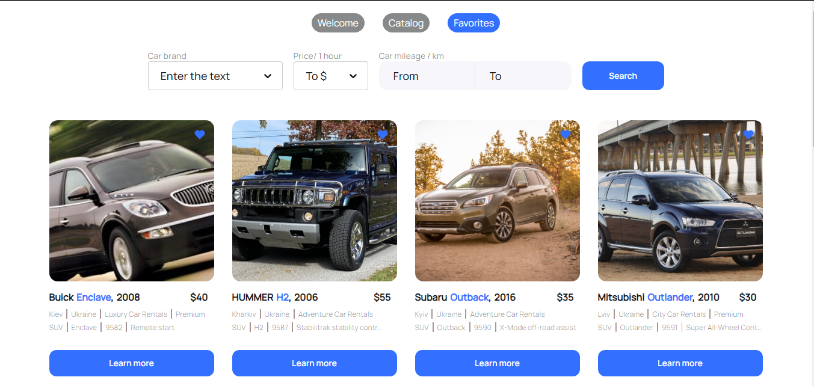
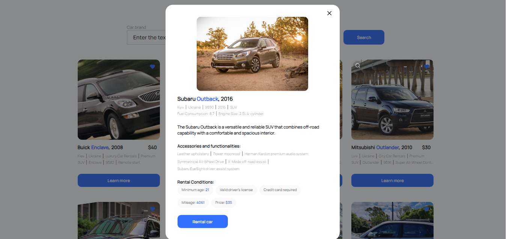

# Autoventure Rentals

AutoRental is an online platform that allows users to find and reserve rental
cars. Users can browse the available fleet, compare prices and car features, as
well as make online reservations.

## Key Features

1. Browse available rental cars
2. Search for cars by various criteria (make, price range, body type, etc.)
3. Filter search results
4. Detailed information about each car (technical specifications, photos, etc.)
5. Online car reservation

## Technologies

This project utilizes modern web development technologies, including:

Frontend: HTML, CSS, JavaScript, React.js Backend: mockAPI

### Authors

This project is created by Yurii Novosad

### Screenshots

 
